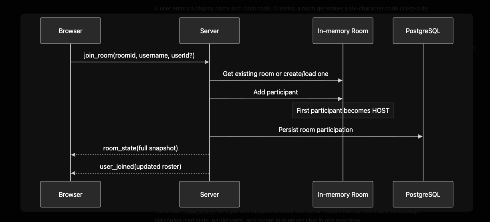
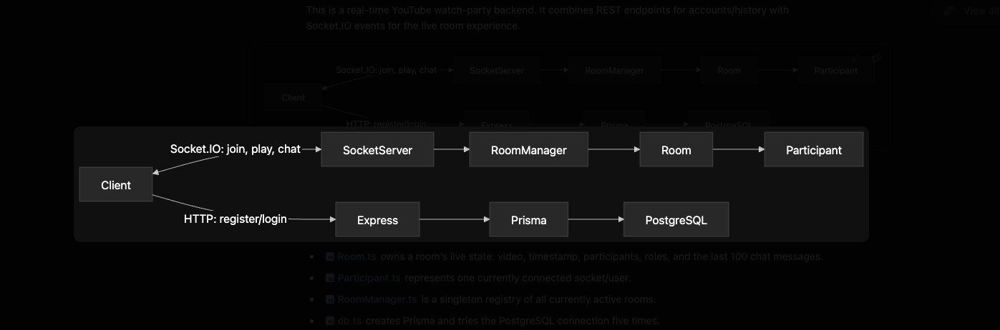

# 🏗️ syncbits Watch Party Architecture

This document provides a detailed overview of the system architecture, real-time data flows, latency compensation algorithms, and database entity relationships powering **syncbits Watch Party**.

---
## 📐 System Architecture Diagram   

--------------------------------------------------------------------


```
 ┌───────────────────────────────────────────────────────────┐
 │                   React + Vite Frontend                   │
 │  ┌─────────────────┐  ┌──────────────┐  ┌──────────────┐  │
 │  │ YouTubePlayer   │  │   ChatBox    │  │ParticipantLst│  │
 │  │ (IFrame API)    │  │  (Realtime)  │  │  (RBAC UI)   │  │
 │  └─────────────────┘  └──────────────┘  └──────────────┘  │
 └─────────────────────────────┬─────────────────────────────┘
                               │ WebSocket Bidirectional Events (Socket.IO)
 ┌─────────────────────────────▼─────────────────────────────┐
 │                Node.js + Express Backend                  │
 │                                                           │
 │  ┌─────────────────┐  ┌──────────────┐  ┌──────────────┐  │
 │  │   RoomManager   │  │     Room     │  │ Participant  │  │
 │  │   (Singleton)   │──► (OOP Model)  │──► (OOP Model)  │  │
 │  └─────────────────┘  └──────────────┘  └──────────────┘  │
 └─────────────────────────────┬─────────────────────────────┘
                               │ Prisma ORM (Async / Fallback)
 ┌─────────────────────────────▼─────────────────────────────┐
 │            PostgreSQL Database (Neon Tech / Cloud)        │
 └───────────────────────────────────────────────────────────┘
```

---

## 📡 WebSocket Integration & Data Flow

WebSockets (powered by **Socket.IO 4**) form the core real-time communication channel:

```
[ Client A (Host) ]          [ Node.js Server ]          [ Client B (Participant) ]
        │                           │                                │
        │── emit("play", {time}) ──►│                                │
        │                           │── validate RBAC permissions ──►│
        │                           │── calculate serverTimestamp ──►│
        │                           │── broadcast("play", payload) ─►│
        │                           │                                │── adjust rate (1.08x)
```

1. **Connection & Session Handshake**:
   - On landing, the client initializes a single persistent WebSocket connection (`socket.ts`).
   - Upon joining or creating a room (`join_room`), the server registers the client in a dedicated Socket.IO room channel (`room.code`).
2. **Bidirectional Control Broadcast**:
   - When a Host performs an action (Play, Pause, Seek, Change Video), the client emits a socket event containing local timestamp and payload.
   - The backend validates the socket's permission (`HOST` or `MODERATOR`), updates room state, and broadcasts to other members via `socket.broadcast.to(room.code).emit(...)`.

---

## ⏱️ Sub-200ms Latency Compensation Math

To achieve precise frame alignment across varying network latencies:

1. **Server Timestamping**: The backend attaches a server UTC timestamp (`serverTimestamp = Date.now()`) and `senderSocketId` to every broadcasted event.
2. **Transit Time Math**:
   $$L = \max\left(0, \frac{\text{Date.now}() - \text{serverTimestamp}}{1000}\right)$$
   If the video is playing, expected timestamp is calculated as:
   $$\text{expectedTime} = \text{currentTime} + L$$
3. **Sender Echo Suppression**: Broadcasts strictly use `socket.broadcast.to(room.code).emit(...)`. The controller does not receive a delayed echo, eliminating playback flashes.

---

## ⚡ 3-Tier Adaptive Speed Engine

To eliminate continuous buffering pauses during playback micro-drifts:

- **Tier 1 ($< 150\text{ms}$ drift)**: Normal `1.0x` playback rate.
- **Tier 2 ($150\text{ms} \le \text{drift} \le 1.2\text{s}$)**:
  - If participant is behind Host: Player speeds up to **`1.08x` (+8%)** for 1–2 seconds.
  - If participant is ahead of Host: Player slows to **`0.92x` (-8%)**.
  - **Result**: Catches up to the exact matching frame seamlessly with **zero video buffering and zero audio stutter**.
- **Tier 3 ($> 1.2\text{s}$ drift)**: Performs direct `seekTo(expectedTime, true)`.
- **Mobile WebKit Safeguard**: Mobile devices lock playback speed at `1.0x` to prevent WebKit media decoder loops.

---

## 🗄️ Database Entity Relationship Model (ERD)

```
┌──────────────────┐       1:N       ┌──────────────────┐
│       User       │─────────────────┤       Room       │
│──────────────────│                 │──────────────────│
│ id (PK)          │                 │ id (PK)          │
│ email (Unique)   │                 │ code (Unique)    │
│ password         │                 │ videoId          │
│ name             │                 │ hostUserId (FK)  │
└────────┬─────────┘                 └────────┬─────────┘
         │ 1:N                                │ 1:N
         │                                    │
┌────────┴─────────┐                 ┌────────┴─────────┐
│   Participant    │                 │   ChatMessage    │
│──────────────────│                 │──────────────────│
│ id (PK)          │                 │ id (PK)          │
│ socketId (Unique)│                 │ roomId (FK)      │
│ userId (FK)      │                 │ username         │
│ roomId (FK)      │                 │ text             │
│ role (Enum)      │                 │ timestamp        │
└──────────────────┘                 └──────────────────┘
```
